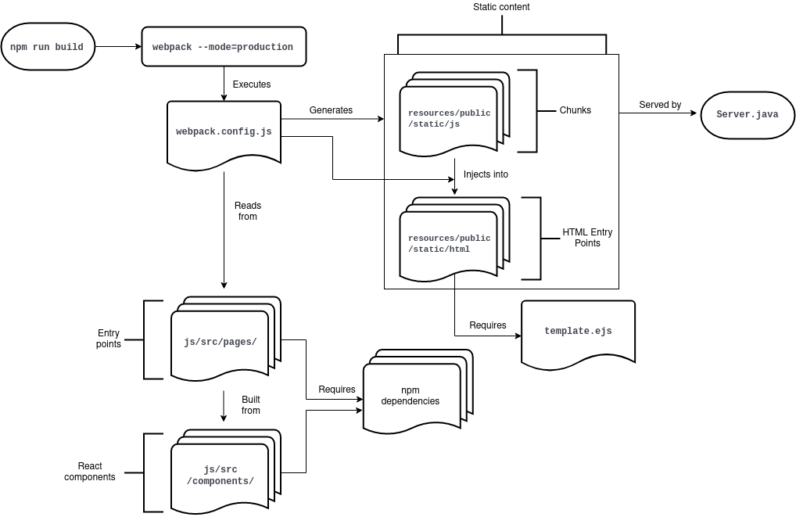

# Plenum

**NOTE: This is a mirror of the repository used to develop Plenum, a project for CS421 at Johns Hopkins University. It constituted a colloboration between the following individuals: [exu6jh](https://github.com/exu6jh), [leezionf](https://github.com/leezionf), [rcheng15jhu](https://github.com/rcheng15jhu), [melodyhplee](https://github.com/melodyhplee), and myself**

This package represents the fifth iteration of Plenum, a simple peer-scheduling application. In order to use this
iteration of Plenum, the current deployed build of the project can be found in Heroku at
http://damp-spire-88649.herokuapp.com/. Alternatively, to access the code in a dev environment, the main function of
Server.java can be ran, and npm start can be run in the src/main/js folder, and after server initialization, the frontend
of the application can be accessed at localhost:3000. 

A lot of work done in this iteration was code refactorization and overall cleaning of the code. Edit profile was added to allow for people to change their profile information. We increased the number of time slots so each slot represents 15 minutes instead of 2 hours. We added real time preview of selected calendar in view-event and calendar creation and modification in view-event. Additionally, some documentation was prepared for the class presentation. For example, this the activity diagram describing the front-end build process: 

A new Dashboard page was added that allows the user to preview all their items at once, including their calendars, events, and the public events. This page is linked as the new home page. 

The available routes in main are the root route which displays a simple message,
- "api/calendars" which gets a list of calendars as a JSON file,
- "api/calendar" which takes a calendar ID and gets the availabilities of the corresponding calendar,
- "api/aggregate" which takes an event ID and gets an aggregate of all availabilities associated with the event,
- "api/addcalendar" which adds (through post) a new calendar,
- "api/delcalendar" which takes an ID and deletes (through post) the corresponding calendar,
- "api/events" which gets a list of events as a JSON file, 
- "api/addevent" which adds (through post) a new event,
- "api/delevent" which takes an ID and deletes (through post) the corresponding event,
- "viewevent" which allows the user to view aggregate availability.
- "users" which gets a list of users as a JSON file,
- "adduser" which adds (through post) a new user,
- "deluser" which takes an ID and deletes (through post) the corresponding user,
- "availabilities" which gets a list of availabilities as a JSON file,
- "addavailability" which adds (through post) a new user,
- "delavailability" which takes an ID and deletes (through post) the corresponding availability,
- "api/updateavailability", which updates the availability corresponding to supplied parameters,
- "api/addconnection", which creates a new connection based off of event, calendar, and user parameters,
- "api/delconnection", which deletes a connection based off of the parameters,
- "api/updateconnection", which changes the connections depending on the given parameters,
- "api/changepassword", which allows the user to change their password, and
- "api/editprofile", which allows the user to change parts of their profile info.
- "api/getprofile", which allows the user to get each component of their profile info.

Small guide of each page:
- List-calendar, List-events: you can press the + button to add new calendars or events. On the right, you can see your selected calendar or event.

- Each creation page for the calendar and event creation has instructions written on the page. When creating an event, you can select a calendar to go along with the event.

- You can log out or view your profile page by clicking on the top right corner.

- You can also see our dashboard by clicking the home button at the top left!

